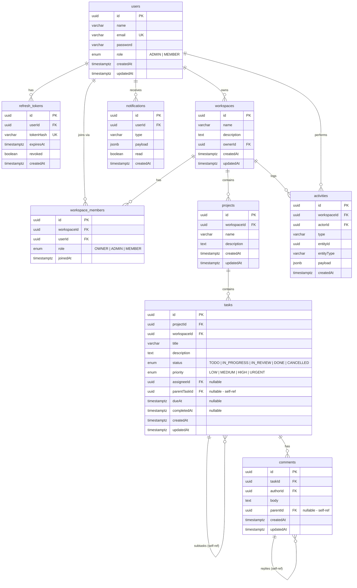

# TaskFlow — Entity Relationship Diagram

## Index summary

| Table | Index name | Columns | Purpose |
|---|---|---|---|
| tasks | IDX_tasks_project_status | (projectId, status) | Task list by project + filter by status |
| tasks | IDX_tasks_assigneeId_status | (assigneeId, status) | My tasks view |
| tasks | IDX_tasks_dueAt | (dueAt) | Cron scanner range query |
| workspace_members | IDX_ws_members_workspaceId | (workspaceId) | Membership lookup |
| workspace_members | IDX_ws_members_userId | (userId) | User's workspaces list |
| activities | IDX_activities_workspaceId_createdAt | (workspaceId, createdAt) | Activity feed |
| notifications | IDX_notifications_userId_createdAt | (userId, createdAt DESC) | Notifications inbox |
